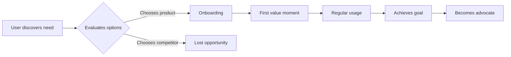

# Product Vision: [PRODUCT NAME]

**Created**: [DATE]
**Status**: Active | Evolving | Superseded
**Input**: Product concept: "$ARGUMENTS"

## Execution Flow (main)
```
1. Parse product concept from Input
   → If empty: ERROR "No product description provided"
2. Extract key concepts: problem space, target users, value proposition
3. For each unclear aspect:
   → Mark with [NEEDS CLARIFICATION: specific question]
4. Research Phase: Conduct strategic research
   → Market research: competitors, alternatives, market size
   → User research: target personas, pain points, workflows
   → Competitive analysis: differentiation opportunities
   → Document findings in this template
5. Define Problem Statement & Opportunity
   → If no clear problem: ERROR "Cannot determine problem being solved"
6. Create Target Users & Personas
   → At least 2-3 detailed personas required
7. Generate Product-Wide User Stories
   → Strategic level, not feature-specific
8. Create User Journey Maps (Mermaid diagrams - user perspective only)
9. Define Success Metrics & KPIs
   → Should be measurable and tied to business value
10. Document Product-Wide Non-Functional Requirements
    → Performance, security, scale, compliance constraints
11. Analyze Business Risks & Mitigation
12. VALIDATION GATE: Check for technical content
    → If system architecture found: ERROR "Remove technical architecture"
    → If API design found: ERROR "Remove API/implementation details"
    → If technology choices found: ERROR "Remove technology decisions"
    → Technical content belongs in /plan, not product vision
13. Return: SUCCESS (product vision ready for /specify)
```

---

## ⚡ Quick Guidelines
- ✅ Focus on PROBLEM, USERS, and VALUE
- ✅ Strategic direction and business opportunity
- ✅ Product-wide requirements (apply to ALL features)
- ❌ Avoid ALL technical decisions (no architecture, APIs, tech stack)
- 👥 Written for product leadership and stakeholders

### Section Requirements
- **Mandatory sections**: Should be completed for every product
- When a section doesn't apply, remove it entirely (don't leave as "N/A")

### For AI Generation
When creating this vision from a user prompt:
1. **Focus on business value**: Why does this product need to exist?
2. **Mark all ambiguities**: Use [NEEDS CLARIFICATION: specific question]
3. **No technical speculation**: Don't suggest architectures or technologies
4. **Think like a product manager**: Strategic outcomes, not implementation details

---

## Problem Statement

### What Problem Are We Solving?
[Clear, concise description of the core problem from the user's perspective]

### Who Experiences This Problem?
[Target audience description - who feels the pain?]

### Why Is This Problem Worth Solving?
[Business case: market opportunity, user impact, strategic importance]

## Market Opportunity

### Market Size & Dynamics
- **Total Addressable Market (TAM)**: [Market size estimate]
- **Serviceable Addressable Market (SAM)**: [Realistic market segment]
- **Market Trends**: [Relevant industry trends supporting this opportunity]

### Competitive Landscape
- **Competitor 1**: [Strengths, weaknesses, positioning]
- **Competitor 2**: [Strengths, weaknesses, positioning]
- **Alternatives**: [What users do today without this product]

### Differentiation
[What makes this product unique or better? Why will users choose it?]

---

## Target Users & Personas

### Persona 1: [Persona Name]

**Demographics**:
- **Role/Title**: [Job title or role description]
- **Context**: [Work environment, team size, organization type]
- **Experience Level**: [Beginner, intermediate, expert in domain]

**Goals & Motivations**:
- Primary goal: [What they're trying to achieve]
- Success looks like: [How they measure success]
- Motivations: [What drives them]

**Pain Points & Frustrations**:
- Current workflow: [How they work today]
- Specific pain: [What frustrates them most]
- Impact: [Cost of the problem - time, money, quality]

**Needs from This Product**:
- Must have: [Critical capabilities]
- Should have: [Important but not critical]
- Behaviors: [How they'll use the product]

### Persona 2: [Persona Name]

[Repeat structure for each persona - aim for 2-5 personas]

---

## Product-Wide User Stories

### Core User Stories

1. **As a [persona]**, I want to [high-level action] so that [strategic benefit]
   - **Value**: [Business or user value delivered]
   - **Acceptance**: [High-level outcome that indicates success]

2. **As a [persona]**, I want to [high-level action] so that [strategic benefit]
   - **Value**: [Business or user value delivered]
   - **Acceptance**: [High-level outcome that indicates success]

3. **As a [persona]**, I want to [high-level action] so that [strategic benefit]
   - **Value**: [Business or user value delivered]
   - **Acceptance**: [High-level outcome that indicates success]

*Note: These are product-level stories. Feature-specific stories belong in /specify.*

---

## User Journey Maps

### Primary User Journey



### Journey Details

**Discovery Phase**:
- How users find the product: [Channels, triggers]
- Decision criteria: [What influences choice]

**Onboarding Phase**:
- First impressions: [Initial experience goals]
- Time to value: [How quickly users see benefit]

**Regular Usage Phase**:
- Core workflow: [Primary user activities]
- Engagement patterns: [Frequency, duration, depth]

**Success & Retention Phase**:
- Success indicators: [What keeps users coming back]
- Advocacy triggers: [What makes users recommend]

---

## Success Metrics & KPIs

### North Star Metric
**[Primary metric that indicates product success]**: [Target value]

*Rationale*: [Why this metric best represents product health and user value]

### Key Performance Indicators

#### Acquisition Metrics
- **Metric 1**: [e.g., New signups per month] - Target: [Value]
- **Metric 2**: [e.g., Conversion rate from trial] - Target: [Value]

#### Engagement Metrics
- **Metric 1**: [e.g., Daily active users] - Target: [Value]
- **Metric 2**: [e.g., Feature adoption rate] - Target: [Value]

#### Retention Metrics
- **Metric 1**: [e.g., 30-day retention rate] - Target: [Value]
- **Metric 2**: [e.g., Churn rate] - Target: [Value]

#### Business Metrics
- **Metric 1**: [e.g., Revenue per user] - Target: [Value]
- **Metric 2**: [e.g., Customer acquisition cost] - Target: [Value]

### Success Timeline
- **3 months**: [Early success indicators]
- **6 months**: [Product-market fit signals]
- **12 months**: [Scale and growth targets]

---

## Product-Wide Non-Functional Requirements

*These requirements apply to ALL features. Features may add more specific NFRs but cannot contradict these.*

### Performance Requirements
- **Response Time**: [e.g., "< 200ms for API responses (p95)"]
- **Throughput**: [e.g., "Support 1000 requests/second"]
- **Load Time**: [e.g., "Initial page load < 2 seconds"]

### Security Requirements
- **Authentication**: [e.g., "Multi-factor authentication required for admin"]
- **Data Protection**: [e.g., "Encrypt PII at rest and in transit"]
- **Access Control**: [e.g., "Role-based access control (RBAC)"]
- **Audit**: [e.g., "Audit logs for all data changes"]

### Scalability Requirements
- **User Scale**: [e.g., "Support 10,000 concurrent users"]
- **Data Scale**: [e.g., "Handle 1TB of user data per organization"]
- **Growth Capacity**: [e.g., "Scale to 10x users within 12 months"]

### Availability Requirements
- **Uptime**: [e.g., "99.9% availability (SLA)"]
- **Disaster Recovery**: [e.g., "RPO < 1 hour, RTO < 4 hours"]
- **Maintenance Windows**: [e.g., "Planned downtime < 4 hours/month"]

### Compliance Requirements *(if applicable)*
- **Regulatory**: [e.g., "GDPR compliant for EU users"]
- **Industry Standards**: [e.g., "SOC 2 Type II certification"]
- **Data Residency**: [e.g., "Support EU and US data centers"]

### Usability Requirements
- **Accessibility**: [e.g., "WCAG 2.1 Level AA compliance"]
- **Browser Support**: [e.g., "Latest 2 versions of Chrome, Firefox, Safari, Edge"]
- **Mobile Support**: [e.g., "iOS 14+ and Android 10+"]
- **Localization**: [e.g., "Support English, Spanish, French, German"]

---

## Business Risk Analysis

### Risk 1: [Risk Name, e.g., "Market Adoption Risk"]

**Description**: [What could go wrong from a business perspective]

**Impact**: [High | Medium | Low] - [Consequence if risk materializes]

**Likelihood**: [High | Medium | Low] - [Probability of occurrence]

**Mitigation Strategy**:
- [Business strategy to reduce risk]
- [Contingency plan if risk occurs]

**Owner**: [Who owns this risk mitigation]

### Risk 2: [Risk Name, e.g., "Competitive Response"]

[Repeat structure for each major risk - aim for 3-5 key risks]

---

## Edge Cases & Exceptional Scenarios

*From business/user perspective, not technical implementation*

### User Behavior Edge Cases
- **What if**: User has no internet connection?
  - **Impact**: [Cannot access product features]
  - **Business Consideration**: [Offline mode? Graceful degradation?]

- **What if**: User's organization blocks external services?
  - **Impact**: [Cannot use product at work]
  - **Business Consideration**: [On-premise option? Different deployment?]

### Market & Business Edge Cases
- **What if**: Major competitor makes product free?
  - **Business Response**: [Value differentiation, pivot strategy]

- **What if**: Regulatory changes impact core feature?
  - **Business Response**: [Compliance adaptation plan]

### Scale Edge Cases
- **What if**: Product goes viral and 10x expected users sign up?
  - **Business Consideration**: [Capacity planning, resource scaling]

---

## Validation Checklist

### Strategic Completeness
- [ ] Problem statement is clear and customer-focused
- [ ] Market opportunity is quantified and validated
- [ ] Competitive differentiation is articulated
- [ ] Target personas are detailed and realistic
- [ ] User journey maps show end-to-end experience

### Requirements Quality
- [ ] Product-wide NFRs are measurable and testable
- [ ] Success metrics tied to business value
- [ ] No [NEEDS CLARIFICATION] for strategic decisions
- [ ] All risks have mitigation strategies
- [ ] Edge cases considered from user perspective

### Technical Content Gate (CRITICAL)
- [ ] **NO system architecture diagrams**
- [ ] **NO API design or endpoints**
- [ ] **NO technology stack decisions**
- [ ] **NO implementation strategies**
- [ ] **NO database or infrastructure design**

*If any technical content found: REMOVE IT. Technical decisions belong in /plan.*

---

## Review & Approval

### Stakeholder Sign-off
- [ ] Product Leadership: [Name] - [Date]
- [ ] Business Stakeholders: [Name] - [Date]
- [ ] User Research: [Name] - [Date]

### Next Steps
Once approved, this product vision will inform all feature specifications via `/specify` command.

---

## Execution Status
*Updated by main() during processing*

- [ ] Product concept parsed
- [ ] Strategic research completed
- [ ] Problem statement defined
- [ ] Personas created (minimum 2)
- [ ] User stories generated
- [ ] Journey maps created
- [ ] Success metrics defined
- [ ] Product-wide NFRs documented
- [ ] Risks analyzed with mitigations
- [ ] Edge cases considered
- [ ] Technical content gate passed
- [ ] Validation checklist completed
